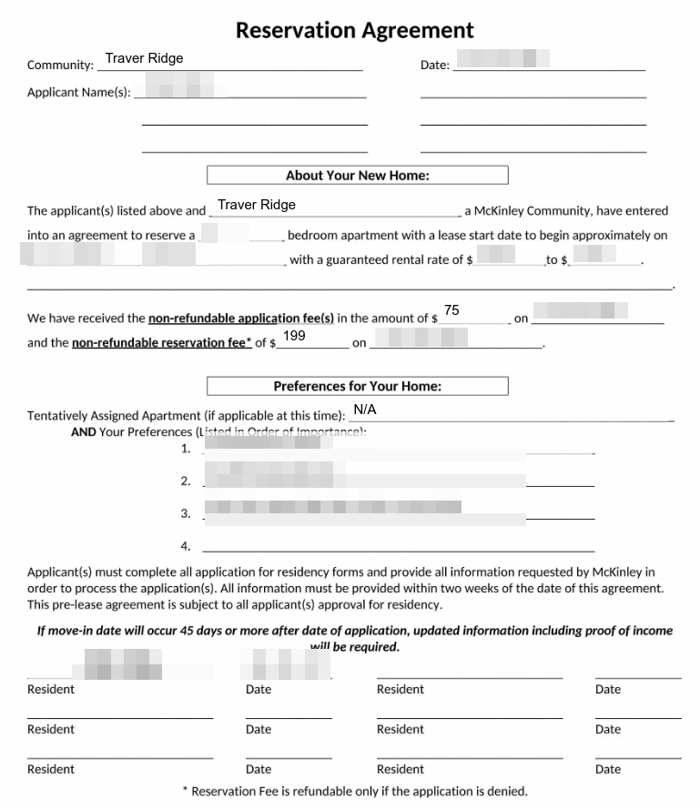

# Traver Ridge Apartments

## 介绍

​	Traver Ridge地处密大的北边，距离较远不建议无车居住（下雪天不能骑车 有待考证），但如果多人合租的话可以以较低的价格获取较大面积的房间（1000+sq.ft.)。

​	更多信息可以查看[官网](https://www.mckinley.com/apartments/michigan/ann-arbor/traver-ridge)或者直接联系客服：

- 电话：[+1 734-761-3325](tel:+1 734-761-3325) 
- 邮箱：[traverridge@mckinley.com](mailto:traverridge@mckinley.com)

## 申请流程与注意事项

​	尽管官网上有在线申请，但最终tr都要打电话进行确认请求与缴费，所以建议使用邮件或者电话询问信息。

​	以下流程来源个人经历（21年5月）。

- 由于是提前预订租房，住户可以申请**Reservation**来预留一个房间，协议内容主要包括

  - 入住时间
  - 价格区间
  - 住户自己提出的preference：房间的楼层，位置，朝向等

  

图：Reservation Agreement

- 在提交Reservation并且申请通过之后，需要缴纳199刀的reservation fee，如果对方tr方不违约（比如未能提供相应的房源）这笔钱是**无法退回**的，因此要做好决定。
- 除此之外，每个入住的住户都要缴纳75刀的application fee，这笔钱是**无论如何**都退不了的，目测是为了审查住户资质（但意义属实不明）
- 等待签证办理完成后需要发送一下签证与护照信息。
- 正式的Lease（租房合同）会在之后签署。（有待考证）
- 对于无收入人群租房的担保制度，可以不需要担保人（guarantor），但需要在入住之后缴纳500刀的押金（离开时退还）。

## TODO 各种费用（租金、申请费、水电网费等）

## TODO 交通信息

## TODO 服务设施

## TODO 周边

