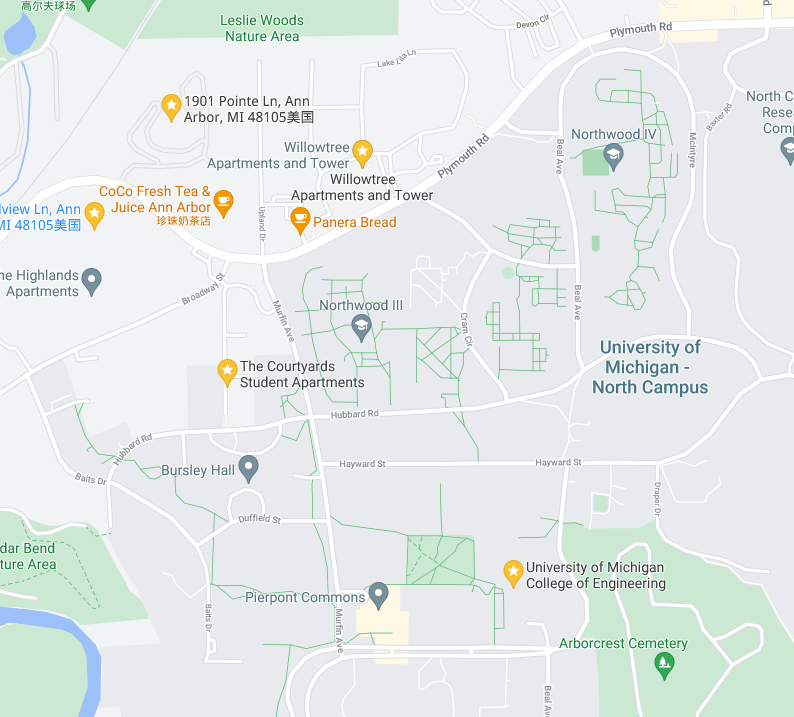

# Overview

​	DD的同学大都会在入学后进入位于北校的工学院(CoE)学习，因此也倾向于在北校附近寻找房源入住。

## 位置

​	公寓位置是在选择中比较重要的因素，本节对北校比较热门的公寓距离工学院的距离以及周边的交通情况进行了一个对比。

### 参考

为了对距离有大概的概念，我们取一个比较有代表性的距离：寝室到龙宾楼，并标记为**1龙**

**寝室->龙宾楼**

+ *1.6km*
+ 骑车大约*7min*

图：从寝室到龙宾楼

### 对比

>  距离数据来源[google map](https://www.google.com/maps/place/University+of+Michigan+College+of+Engineering/@42.2987848,-83.7104629,15.38z/data=!4m21!1m15!4m14!1m5!1m1!1s0x0:0x91129468b79a3a39!2m2!1d-83.713924!2d42.2915565!1m6!1m2!1s0x883cae7de979896b:0x52140ea84cf8c3b8!2sThe+Courtyards+Student+Apartments,+1780+Broadway+St,+Ann+Arbor,+MI+48105%E7%BE%8E%E5%9B%BD!2m2!1d-83.7214418!2d42.2954635!3e2!3m4!1s0x0:0x91129468b79a3a39!8m2!3d42.2915565!4d-83.713924)
>
> TODO 添加公交信息
>
> TODO 添加到其它位置，如超市之类地点的距离

| 公寓名                  | 走路距离(到工学院) | 公交信息 |
| ----------------------- | ------------------ | -------- |
| **Courtyards**          | 1.3km (0.8龙)      |          |
| **Willowtree**          | 1.4km (0.9龙)      |          |
| **Broadview Ann Arbor** | 1.8km (1.1龙)      |          |
| **Traver Ridge**        | 2.3km (1.4龙)      |          |

## 公寓介绍

- Traver Ridge [详细信息](./detail-traverridge.md)
  - 房型
    - 1 Bedroom 1 Bathroom \$1,169-\$1,559
    - 2 Bedrooms 2 Bathrooms \$1,419-\$1,849 （整套）
    - 3 Bedrooms 2 Bathrooms \$1,679-\$2,089 （整套）
  - 网址：https://www.mckinley.com/apartments/michigan/ann-arbor/traver-ridge

## 参考

[1]  [2021 CSSA新生手册第三期：校外租房篇（北校）](https://mp.weixin.qq.com/s/XL8AQ3tAoDwIneV5o78Bmg)

[2] [Offcampus Housing-University of Michigan](https://offcampushousing.umich.edu/housing/campus-University+of+Michigan+--+North+Campus)

